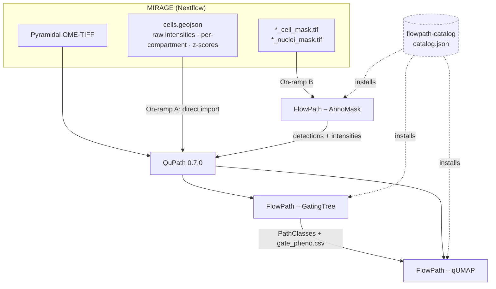

# How it all fits together

[MIRAGE](mirage.md) runs as a Nextflow pipeline and emits a few artifacts.
FlowPath gives you **two on-ramps** to get those into QuPath, then two analysis
tools to work with them. The [catalog](catalog.md) is simply how you *install*
the extensions — it is not a step in the data flow.

## The two on-ramps

The whole design hinges on one fact: **GatingTree and qUMAP operate on QuPath
detections that carry per-marker measurements.** There are two ways to create
those detections, and they're interchangeable.

=== "On-ramp A — direct GeoJSON import"

    Open the OME-TIFF in QuPath and import MIRAGE's `cells.geojson` directly.
    This is the fastest path, since MIRAGE already did the quantification — the
    detections arrive with every measurement attached.

    **Use when:** you ran MIRAGE through its GeoJSON export.

=== "On-ramp B — AnnoMask on a label mask"

    Skip the GeoJSON export and bring MIRAGE's label masks
    (`*_cell_mask.tif` / `*_nuclei_mask.tif`) into QuPath via
    [AnnoMask](annomask.md). It traces one detection per label and, optionally,
    re-derives per-channel intensities **in-app** using the *same bincount pass*
    MIRAGE uses in `bin/quantify.py` — so the values are identical.

    **Use when:** all you have on disk is a labeled mask (from MIRAGE, Cellpose,
    StarDist, or a custom pipeline).

!!! success "Why the two on-ramps are equivalent"
    AnnoMask reuses MIRAGE's exact intensity computation and keys measurements
    by **bare channel name** (`CD45`, `DAPI`) — the same keys MIRAGE's GeoJSON
    uses. A GeoJSON AnnoMask produces is plug-compatible with one MIRAGE wrote.
    See [Measurement Keys](measurement-keys.md).

## The flow through the tools

1. **Get cells in** via on-ramp A or B → QuPath detections with measurements.
2. **[GatingTree](gatingtree.md)** assigns **PathClasses** (named phenotypes)
   and exports `gate_pheno.csv` + `flowpath.json`.
3. **[qUMAP](qumap.md)** embeds the measurements in 2D and colors by those
   PathClasses; it can also tag new populations back onto the objects.

GatingTree and qUMAP both read the same measurement model, so phenotypes you
define in one are visible in the other.

## What each component reads and writes

| Component | Reads | Writes |
|---|---|---|
| **[AnnoMask](annomask.md)** | label mask (+ OME-TIFF for intensities) | QuPath detections / GeoJSON (bare-channel intensities) |
| **[GatingTree](gatingtree.md)** | detections with measurements | PathClasses · `flowpath.json` · `gate_pheno.csv` |
| **[qUMAP](qumap.md)** | detections + PathClasses | PathClasses (tags) · `umap_coordinates.csv` |
| **[Catalog](catalog.md)** | — (install hub) | — |

## Where MIRAGE ends and FlowPath begins

MIRAGE stops at **quantified cells**: a pyramidal OME-TIFF, a `cells.geojson`,
and label masks. Everything on this site happens *after* that, inside QuPath.
For how those inputs are produced, see the
[MIRAGE upstream page](mirage.md) and MIRAGE's own
[export](https://mirage-pipeline.readthedocs.io/) and quantification docs.
