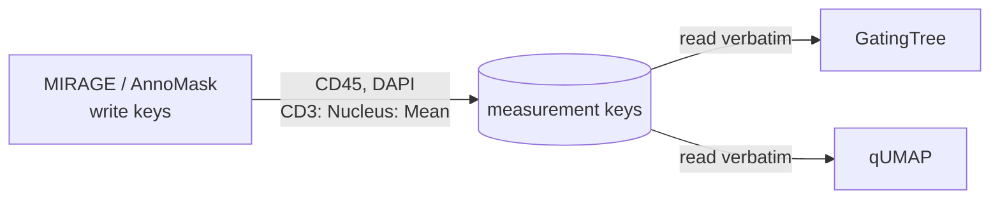

# Measurement keys

This is the quiet superpower of the integration. MIRAGE and FlowPath agree on a
**naming contract** for cell measurements, so nothing needs to be reshaped
between them — no renaming, no remapping, no CSV surgery.

## The two key conventions

MIRAGE (and AnnoMask) write per-cell measurements under two conventions:

| Convention | Example key | Meaning |
|---|---|---|
| **Bare marker** | `CD45`, `DAPI` | Whole-cell mean intensity for that channel. This is the AnnoMask convention. |
| **Per-compartment** | `CD3: Nucleus: Mean` | `"<MARKER>: <Compartment>: <Statistic>"` — a specific compartment and statistic. |

For per-compartment keys:

- **Compartment** ∈ { `Nucleus`, `Cytoplasm`, `Cell` }
- **Statistic** ∈ { `Mean`, `Median`, `Sum` }

## How FlowPath uses them

[GatingTree](gatingtree.md) and [qUMAP](qumap.md) read **exactly these keys**.
That lets you pick the compartment and statistic **per gate or per feature**:

- In GatingTree, each gate can target, say, `CD3: Nucleus: Mean` while another
  uses `PANCK: Cytoplasm: Median`.
- In qUMAP, feature selection mirrors the same compartment / statistic model.

!!! success "Automatic fallback for legacy data"
    If a dataset has **no** per-compartment keys (older exports, or masks
    quantified whole-cell only), GatingTree and qUMAP **fall back to whole-cell
    / Mean** automatically. Nothing breaks — you just don't get the
    compartment choices.

## Why AnnoMask output is interchangeable

When [AnnoMask](annomask.md) samples intensities, it:

1. uses the **same bincount pass** as MIRAGE's `bin/quantify.py` — so the
   numeric values are identical, and
2. keys them by **bare channel name** (`CD45`, `DAPI`).

So a GeoJSON AnnoMask produces is **plug-compatible** with one MIRAGE wrote —
the two on-ramps in [Architecture](architecture.md) really do land in the same
place.

## The payoff

Because both sides speak the same key language, MIRAGE's output is
**plug-and-play** in FlowPath. For the full list of keys MIRAGE emits, see the
[MIRAGE upstream page](mirage.md) and MIRAGE's quantification and outputs docs
at <https://mirage-pipeline.readthedocs.io/>.
