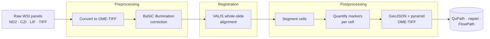

# MIRAGE (upstream)

[MIRAGE](https://github.com/sceriff0/mirage) is the **Nextflow pipeline that
produces FlowPath's inputs**. It is a separate project with its own
documentation — this page is a short orientation and a set of deep links.

!!! abstract "MIRAGE in one sentence"
    *Multiplex Imaging Registration, Analysis, & GeoJSON Export* — a Nextflow
    DSL2 pipeline that takes raw whole-slide microscopy across many marker
    panels and turns it into aligned images, segmented cells, single-cell marker
    tables, and QuPath-ready GeoJSON.

    :material-book-open-variant: **Full docs:** <https://mirage-pipeline.readthedocs.io/>
    · :fontawesome-brands-github: **Source:** <https://github.com/sceriff0/mirage>

## What MIRAGE does

The pipeline runs in three independently restartable stages —
**preprocessing → registration → postprocessing** — and supports three
segmentation backends (StarDist, InstanSeg, CellSAM).

## What it hands to FlowPath

| Artifact | What it is | FlowPath uses it via |
|---|---|---|
| **Pyramidal OME-TIFF** | The registered, multi-channel image | Open directly in QuPath |
| **`cells.geojson`** | Every cell with raw intensities, optional per-compartment measurements, and z-scores | [On-ramp A](architecture.md) — direct import |
| **`*_cell_mask.tif` / `*_nuclei_mask.tif`** | Labeled segmentation masks | [On-ramp B](architecture.md) — [AnnoMask](annomask.md) |

MIRAGE deliberately **stops at quantified cells** — it does not phenotype them.
Gating, phenotyping, and interactive exploration are what FlowPath adds. See
[Architecture](architecture.md) for the hand-off and [Measurement
Keys](measurement-keys.md) for why the output is plug-and-play.

## Deep links into MIRAGE's docs

For details that live on MIRAGE's side, go straight to its documentation:

- :material-export: **How `cells.geojson` is produced** — MIRAGE's *Visualization & Export* page
- :material-chart-scatter-plot: **The measurement keys it emits** — MIRAGE's *Quantification* and *Outputs* pages
- :material-grain: **Segmentation backends and mask outputs** — MIRAGE's *Segmentation* page
- :material-walk: **Running MIRAGE end to end** — MIRAGE's *Walkthrough*

All of the above are at <https://mirage-pipeline.readthedocs.io/>.

!!! note "You don't have to use MIRAGE"
    FlowPath works with any source of detections + measurements. [AnnoMask](annomask.md)
    happily imports Cellpose, StarDist, or custom masks, and GatingTree / qUMAP
    read any GeoJSON with per-marker measurements. MIRAGE is the reference
    upstream because the measurement keys line up perfectly — not a hard
    dependency.

## Citing MIRAGE

If you use MIRAGE alongside FlowPath in published work, please cite both. See
[Citation](citation.md).
