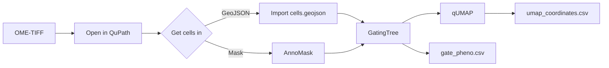

# Walkthrough

This is the end-to-end story: from a quantified slide to gated phenotypes to a
UMAP you can lasso. It assumes you've [installed the suite](installation.md) and
have a multiplexed OME-TIFF on hand — for example one produced by
[MIRAGE](mirage.md).

## 1. Open the image

Open your pyramidal OME-TIFF in QuPath 0.7.0. If it came from MIRAGE, DAPI is on
channel 0 and the remaining channels are your markers.

## 2. Get cells into QuPath

Pick **one** of the two on-ramps (see [Architecture](architecture.md) for why
they're equivalent):

=== "On-ramp A — import GeoJSON"

    `File → Object data → Import objects` and choose MIRAGE's `cells.geojson`.
    Detections arrive with all marker measurements already attached — nothing
    else to do.

=== "On-ramp B — import a mask with AnnoMask"

    `Extensions → FlowPath - AnnoMask` (++ctrl+shift+m++). Point it at
    `*_cell_mask.tif`, enable **intensity sampling**, and run. AnnoMask creates
    one detection per label and samples per-channel mean intensity using the
    same bincount MIRAGE uses — so the measurements are identical.

    <figure class="screenshot" markdown>
    { .glightbox }
    <figcaption>AnnoMask converting a label mask into detections with intensity sampling. <em>(placeholder)</em></figcaption>
    </figure>

Either way you now have **detections carrying per-marker measurements**.

## 3. Gate and phenotype in GatingTree

Open `Extensions → FlowPath - GatingTree` (++ctrl+g++).

1. Set **quality filters** to drop segmentation artifacts (area, eccentricity,
   solidity, perimeter, total intensity).
2. Add a **root gate** and pick a type — threshold (1D), quadrant (2D),
   polygon, rectangle, or ellipse.
3. For a threshold gate: select a channel and drag the line on the histogram.
4. Build a **hierarchy** — e.g. `CD45+ → CD3+ → CD8+`.
5. **Name leaf nodes** ("T cytotoxic", "Tumor", "Stroma").

Cells recolor live as you move thresholds.

<figure class="screenshot" markdown>
{ .glightbox }
<figcaption>A multi-level gate tree; cells in the viewer recolor by phenotype in real time. <em>(placeholder)</em></figcaption>
</figure>

When you're happy, export:

- **`flowpath.json`** — the full gate hierarchy (reload it later or share it),
- **`gate_pheno.csv`** — one row per cell with phenotype + per-marker ± status.

Your cells now carry **PathClasses** for the phenotypes you defined.

## 4. Explore in qUMAP

Open `Extensions → FlowPath - qUMAP` (++ctrl+u++).

1. Adjust UMAP parameters (k, epochs) and subsampling if the slide is large.
2. Click **Compute UMAP**.
3. Cells are colored automatically by the PathClasses GatingTree assigned.
4. Pick a marker to see a **side-by-side expression overlay**.
5. **Draw a polygon** to focus on a cluster; out-of-polygon cells grey out
   (UNFOCUSED). Name + color the selection and **Apply Tag** to store it as a
   derived PathClass.
6. **Export CSV** → `umap_coordinates.csv`.

<figure class="screenshot" markdown>
{ .glightbox }
<figcaption>A UMAP embedding colored by the phenotypes assigned in GatingTree. <em>(placeholder)</em></figcaption>
</figure>

!!! tip "Better together"
    Gate first in GatingTree to assign PathClasses, then color the qUMAP by
    those classes — coherent populations show up as distinct islands in
    embedding space, a quick sanity check on your gates.

## What you end up with

| File | From | Contents |
|---|---|---|
| `flowpath.json` | GatingTree | Gate hierarchy, thresholds, colors, QC settings |
| `gate_pheno.csv` | GatingTree | Per-cell phenotype + per-marker ± status |
| `umap_coordinates.csv` | qUMAP | Per-cell UMAP X/Y + phenotype |
| PathClasses | both | Named populations stored on the QuPath objects |

From here, dig into each tool: [GatingTree](gatingtree.md),
[AnnoMask](annomask.md), [qUMAP](qumap.md).
