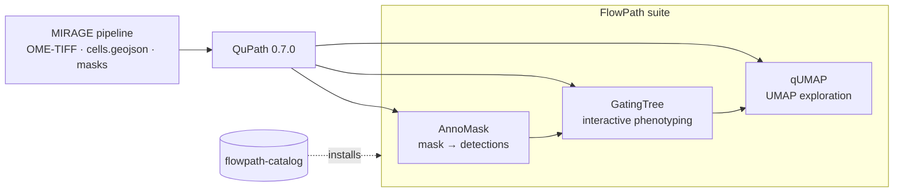

---
hide:
  - navigation
  - toc
---

**FlowJo-style workflows for QuPath**

A suite of [QuPath](https://qupath.github.io/) 0.7.0 extensions that turn
multiplexed imaging into living, clickable biology — hierarchical gates, named
populations, and UMAP embeddings you can lasso. FlowPath picks up where the
[MIRAGE](mirage.md) pipeline leaves off.

[:material-rocket-launch: Get started](installation.md){ .md-button .md-button--primary }
[:material-walk: Walkthrough](walkthrough.md){ .md-button }
[:fontawesome-brands-github: Catalog](https://github.com/sceriff0/flowpath-catalog){ .md-button }

## What FlowPath is

FlowPath brings the muscle-memory of **flow cytometry** — gating populations,
reducing dimensions, lassoing clusters — *inside* QuPath, on **multiplexed
tissue imaging** (CODEX, MIBI, mIF). You segment and quantify cells once, then
phenotype and explore them interactively without leaving the viewer.

It is a **family of extensions**, installed from a single catalog:

<figure class="screenshot" markdown>
{ .glightbox }
<figcaption>FlowPath in action inside QuPath — gating tree, recolored cells, and a UMAP embedding. <em>(placeholder — see the screenshot manifest)</em></figcaption>
</figure>

## The four components

-   :material-store:{ .lg .middle } **FlowPath Catalog**

    ---

    The suite's "app store" index. Add one URL in QuPath and install (and later
    update) every extension from one place.

    [:octicons-arrow-right-24: The catalog](catalog.md)

-   :material-file-tree:{ .lg .middle } **GatingTree**

    ---

    Interactive, tree-based **cell phenotyping**. Build hierarchical marker
    gates and watch cells recolor live.

    [:octicons-arrow-right-24: GatingTree](gatingtree.md)

-   :material-image-filter-center-focus:{ .lg .middle } **AnnoMask**

    ---

    Turn a **labeled segmentation mask into QuPath detections** in-app, with
    optional per-channel intensity sampling.

    [:octicons-arrow-right-24: AnnoMask](annomask.md)

-   :material-scatter-plot:{ .lg .middle } **qUMAP**

    ---

    **UMAP** dimensionality reduction of cell measurements — color by
    phenotype and lasso populations in embedding space.

    [:octicons-arrow-right-24: qUMAP](qumap.md)

## Choose your path

-   :material-download:{ .lg .middle } **Install the suite**

    ---

    Add the catalog URL in QuPath and install all three extensions in a couple
    of clicks.

    [:octicons-arrow-right-24: Installation](installation.md)

-   :material-walk:{ .lg .middle } **Run the workflow**

    ---

    From MIRAGE output to gated phenotypes to a UMAP, end to end.

    [:octicons-arrow-right-24: Walkthrough](walkthrough.md)

-   :material-sitemap:{ .lg .middle } **See how it fits**

    ---

    The two on-ramps, the data flow, and where MIRAGE ends and FlowPath begins.

    [:octicons-arrow-right-24: Architecture](architecture.md)

-   :material-key-variant:{ .lg .middle } **Why it's plug-and-play**

    ---

    The measurement-key contract that lets FlowPath read MIRAGE's output with
    no reshaping.

    [:octicons-arrow-right-24: Measurement keys](measurement-keys.md)

!!! tip "New here? Read in this order"
    1. [Installation](installation.md) — add the catalog, install the extensions
    2. [Walkthrough](walkthrough.md) — a full session end to end
    3. [Architecture](architecture.md) — how the pieces connect
    4. The per-extension pages — [GatingTree](gatingtree.md) · [AnnoMask](annomask.md) · [qUMAP](qumap.md)

!!! note "FlowPath and MIRAGE are separate projects"
    The FlowPath extensions are independent, MIT-licensed QuPath extensions by
    [`sceriff0`](https://github.com/sceriff0). [MIRAGE](mirage.md) is the upstream
    Nextflow pipeline that produces their inputs and has its
    [own documentation](https://mirage.readthedocs.io/). If you publish with
    them, please [cite both](citation.md).
