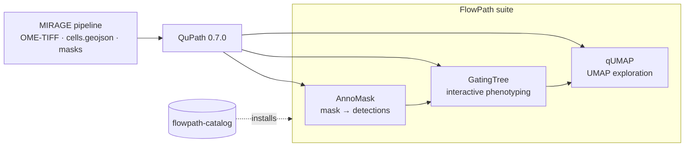

---
hide:
  - navigation
  - toc
---

**FlowJo-style workflows for QuPath**

A suite of three [QuPath](https://qupath.github.io/) 0.7.0 extensions that turn
multiplexed imaging into living, clickable biology — import cells, gate them into
named phenotypes, and explore them in a UMAP you can lasso. FlowPath picks up
where the [MIRAGE](https://mirage-pipeline.readthedocs.io/) pipeline leaves off.

[:material-rocket-launch: Install](installation.md){ .md-button .md-button--primary }
[:material-walk: How to use](usage.md){ .md-button }
[:fontawesome-brands-github: GitHub](https://github.com/sceriff0/flowpath-catalog){ .md-button }

## What FlowPath is

FlowPath brings the muscle-memory of **flow cytometry** — gating populations,
reducing dimensions, lassoing clusters — *inside* QuPath, on **multiplexed tissue
imaging** (CODEX, MIBI, mIF). You segment and quantify cells once, then phenotype
and explore them interactively without leaving the viewer.

It's a family of three extensions that all work on the same shared object —
**QuPath detections carrying per-marker measurements** — installed from a single
catalog:

| Extension | Role | One line |
|---|---|---|
| **AnnoMask** | *import* | Turn a labeled segmentation mask into QuPath detections, with optional intensity sampling. |
| **GatingTree** | *phenotype* | Gate detections into named populations with a live hierarchical tree. |
| **qUMAP** | *explore* | Embed all markers in 2D, color by phenotype, lasso clusters. |

## Where MIRAGE fits

[MIRAGE](https://mirage-pipeline.readthedocs.io/) is a Nextflow pipeline that produces
FlowPath's inputs: a pyramidal **OME-TIFF**, a QuPath-native **`cells.geojson`**,
and labeled **segmentation masks**. It deliberately stops at *quantified cells* —
phenotyping and exploration are what FlowPath adds.

You don't need MIRAGE, though. FlowPath works with **any** source of detections
plus measurements — Cellpose or StarDist masks via AnnoMask, or any GeoJSON with
per-marker measurements. MIRAGE is the reference upstream because the measurement
keys line up exactly (see [Usage → the data model](usage.md#the-data-model)).

## Get started

-   :material-download:{ .lg .middle } **Install the suite**

    ---

    Add one catalog URL in QuPath and install all three extensions in a couple
    of clicks.

    [:octicons-arrow-right-24: Installation](installation.md)

-   :material-walk:{ .lg .middle } **Run the workflow**

    ---

    From cells in QuPath to gated phenotypes to a UMAP, end to end — plus the
    per-tool options.

    [:octicons-arrow-right-24: Usage](usage.md)

!!! note "FlowPath and MIRAGE are separate projects"
    The FlowPath extensions are independent, MIT-licensed QuPath extensions by
    [`sceriff0`](https://github.com/sceriff0).
    [MIRAGE](https://mirage-pipeline.readthedocs.io/) is the upstream Nextflow pipeline,
    with its own documentation. If you publish with them, please
    [cite both](citation.md).
