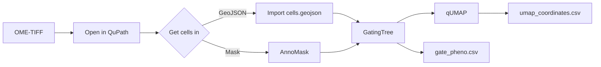

# Usage

The whole workflow is three steps: **get cells into QuPath**, **gate them into
phenotypes**, then **explore them in a UMAP**. This page walks through that end
to end, then lists the per-tool options.

It assumes you've [installed the suite](installation.md) and have a multiplexed
OME-TIFF open in QuPath 0.7.0 — for example one produced by
[MIRAGE](https://mirage-pipeline.readthedocs.io/).



## The data model

Everything in FlowPath operates on one shared object: **QuPath detections that
carry per-marker measurements**. GatingTree and qUMAP read those measurements by
key, and they understand two conventions MIRAGE and AnnoMask write:

| Convention | Example key | Meaning |
|---|---|---|
| **Bare marker** | `CD45`, `DAPI` | Whole-cell mean intensity for that channel (the AnnoMask convention). |
| **Per-compartment** | `CD3: Nucleus: Mean` | `"<MARKER>: <Compartment>: <Statistic>"`, for Nucleus / Cytoplasm / Cell and Mean / Median / Sum. |

Because both sides speak the same key language, MIRAGE's output is plug-and-play:
no renaming, no remapping. If a dataset has **no** per-compartment keys (older
exports, or whole-cell-only masks), GatingTree and qUMAP fall back to whole-cell /
Mean automatically — nothing breaks.

## Step 1 — Get cells into QuPath

Open your pyramidal OME-TIFF. If it came from MIRAGE, DAPI is on channel 0 and the
rest are your markers. Then pick **one** of two equivalent on-ramps:

=== "On-ramp A — import GeoJSON"

    `File → Object data → Import objects` and choose MIRAGE's `cells.geojson`.
    Detections arrive with all marker measurements already attached — nothing
    else to do. Use this when you ran MIRAGE through its GeoJSON export.

=== "On-ramp B — import a mask with AnnoMask"

    `Extensions → FlowPath - AnnoMask` (++ctrl+shift+m++). Point it at a labeled
    mask (`*_cell_mask.tif`), enable **intensity sampling**, and run. AnnoMask
    creates one detection per label and samples per-channel intensity using the
    **same bincount pass MIRAGE uses** — so the measurements are identical. Use
    this when all you have on disk is a labeled mask (MIRAGE, Cellpose, StarDist,
    or custom).

Either way you now have **detections carrying per-marker measurements**, ready to
gate.

??? info "AnnoMask details"
    Given a labeled mask — a single-band integer raster where `0` is background
    and each positive value is a unique cell ID — AnnoMask traces every label's
    contour into one QuPath `PathDetectionObject` per label (multiple connected
    components of the same label merge into one, matching MIRAGE's cell count).

    **Two input modes:** *channel in current image* (a channel whose pixels are
    integer labels) or *load from file* (a `.tif`/`.tiff` on disk, assumed to
    align to the open image's pixel grid).

## Step 2 — Gate and phenotype in GatingTree

Open `Extensions → FlowPath - GatingTree` (++ctrl+g++). Build a hierarchy of
marker gates — e.g. `CD45+ → CD3+ → CD8+ = "T cytotoxic"` — and cells recolor live
as you move thresholds.

1. Set **quality filters** to drop segmentation artifacts (min/max for area,
   eccentricity, solidity, perimeter, total intensity).
2. Add a **root gate** and pick a type — threshold (1D), quadrant (2D), polygon,
   rectangle, or ellipse.
3. For a threshold gate: pick a channel and drag the line on the histogram. For a
   2D gate: pick X/Y channels and draw the region on the scatter plot.
4. Add **child gates** to branches to sub-gate, and **name** leaf nodes
   ("T cytotoxic", "Tumor", "Stroma").
5. Export when happy.

<figure class="screenshot" markdown>
{ .glightbox }
<figcaption>A multi-level gate tree; cells in the viewer recolor by phenotype in real time. <em>(placeholder)</em></figcaption>
</figure>

Your cells now carry **PathClasses** for the phenotypes you defined, and you can
export `flowpath.json` (the full gate hierarchy, reloadable and shareable) and
`gate_pheno.csv` (one row per cell, phenotype + per-marker ± status).

## Step 3 — Explore in qUMAP

Open `Extensions → FlowPath - qUMAP` (++ctrl+u++).

1. Adjust UMAP parameters (k, epochs) and subsampling if the slide is large.
2. Click **Compute UMAP**. Cells are colored automatically by the PathClasses
   GatingTree assigned.
3. Pick a marker for a **side-by-side expression overlay** (z-score, or raw).
4. **Draw a polygon** to focus on a cluster — out-of-polygon cells grey out.
   Name + color the selection and **Apply Tag** to store it as a derived
   PathClass.
5. **Export CSV** → `umap_coordinates.csv`.

<figure class="screenshot" markdown>
{ .glightbox }
<figcaption>A UMAP embedding colored by the phenotypes assigned in GatingTree. <em>(placeholder)</em></figcaption>
</figure>

!!! tip "Gate first, then embed"
    Assign PathClasses in GatingTree, then color the qUMAP by those classes —
    coherent populations show up as distinct islands, a quick visual check on your
    gates.

## What you end up with

| File | From | Contents |
|---|---|---|
| `flowpath.json` | GatingTree | Gate hierarchy, thresholds, colors, QC settings |
| `gate_pheno.csv` | GatingTree | Per-cell phenotype + per-marker ± status |
| `umap_coordinates.csv` | qUMAP | Per-cell UMAP X/Y + phenotype |
| PathClasses | both | Named populations stored on the QuPath objects |

```csv title="gate_pheno.csv"
cell_id,phenotype,CD45,CD3,CD8,PANCK
0,T cytotoxic,+,+,+,-
1,Tumor,-,-,-,+
```

```csv title="umap_coordinates.csv"
UMAP_X,UMAP_Y,Phenotype
-3.241519,1.872034,CD4+
2.109384,-0.543218,CD8+
```

## Options reference

### GatingTree

- **Gate types** — threshold (1D), quadrant (2D dual-threshold), polygon,
  rectangle, ellipse.
- **Per-gate compartment & statistic** — choose Nucleus / Cytoplasm / Cell and
  Mean / Median / Sum per gate (when per-compartment keys exist).
- **Raw / Z-score toggle** — switch value modes per gate (z-score uses MIRAGE's
  own z-scores).
- **Quality filters** — pre-gating QC with min + max for area, eccentricity,
  solidity, total intensity, perimeter.
- **Outlier exclusion** — per-gate percentile clipping, with the scatter axis
  zooming to the clipped range.
- **Undo / Redo** — snapshot-based (++ctrl+z++ / ++ctrl+shift+z++); drag-and-drop
  to reorder gates between branches.

### qUMAP

- **UMAP parameters** — neighbors (`k`) and `epochs`; computed via the
  [SMILE](https://haifengl.github.io/) library.
- **Subsampling** — Auto / Off / Fixed, with stratified sampling that preserves
  phenotype proportions; large slides project the rest via weighted kNN.
- **Expression overlay** — z-score (blue-white-red) or raw intensity (viridis).
- **Population tagging** — name + color a polygon selection and store it as a
  derived PathClass; multiple tags coexist with colored ring overlays.
- **OOM protection** — qUMAP estimates memory before computing and warns if a
  dataset may run out.

| Cell count | Strategy | Expected time |
|---|---|---|
| < 10K | Direct computation | 2–5 s |
| 10K–50K | Direct with progress | 10–30 s |
| 50K–100K | Auto-subsampling recommended | 5–15 s |
| > 100K | Subsampling + kNN projection | 10–30 s |

### AnnoMask

- **Input modes** — channel-in-current-image, or load-from-file.
- **Intensity sampling** — optional; populates bare-channel measurements so
  GatingTree and qUMAP can gate immediately.
- **Output** — detections added to the hierarchy, optionally saved as
  QuPath-native GeoJSON.
